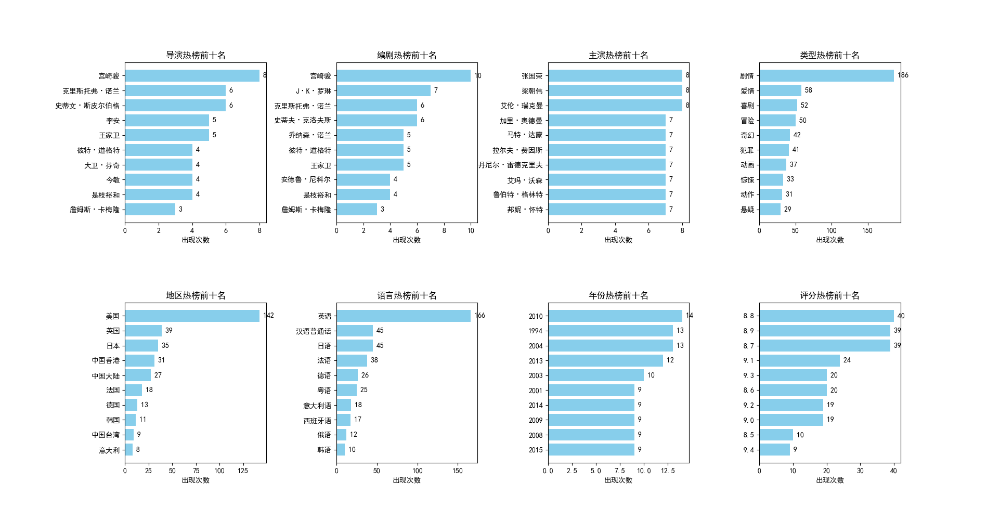
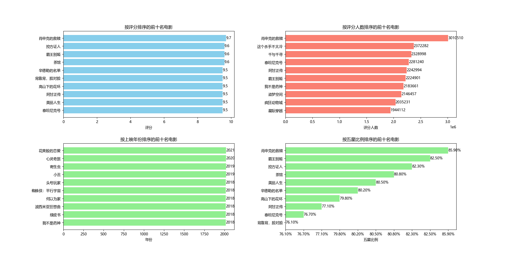
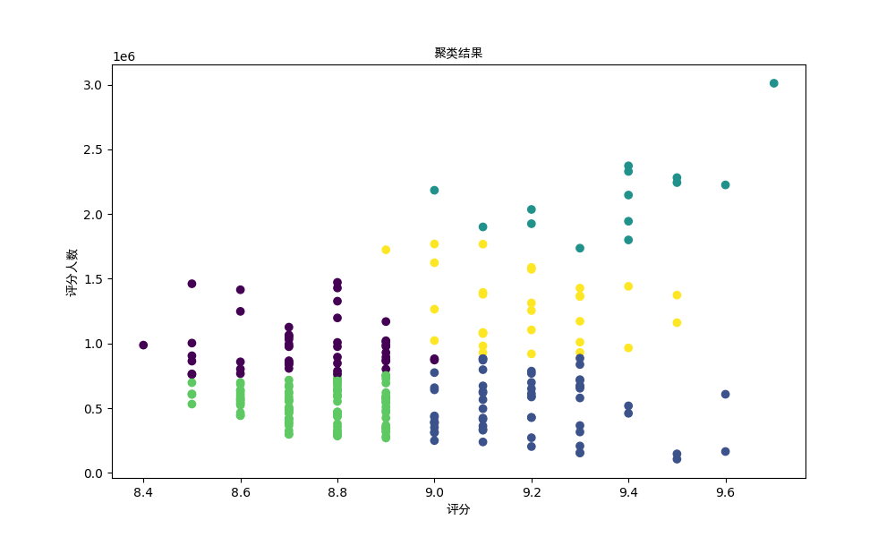
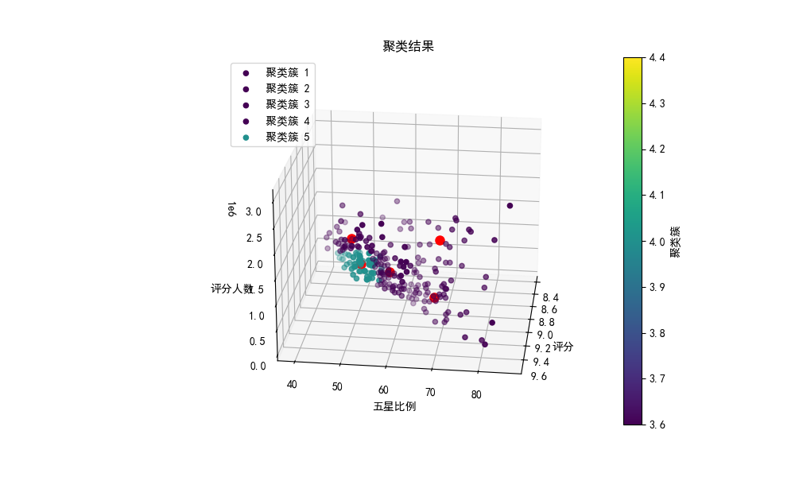
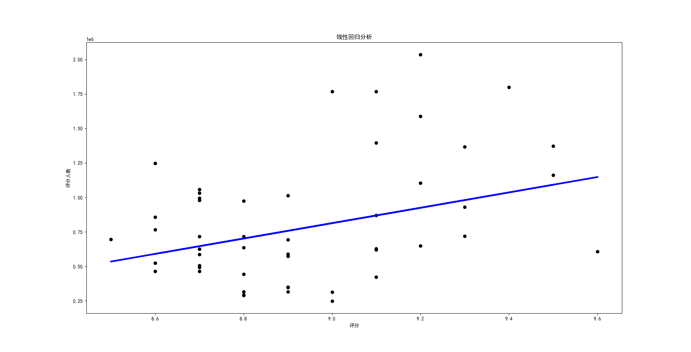
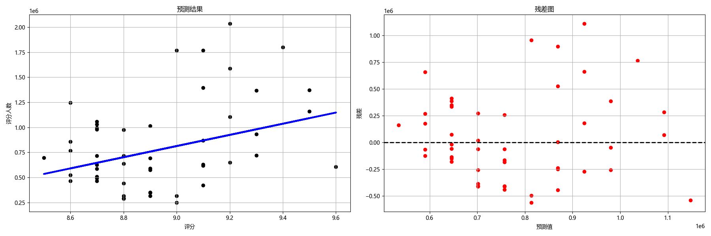

# 豆瓣电影排行榜爬虫

数据分析作业代码，豆瓣电影排行榜数据爬取（排名页面+详情页面），进行简单数据分析。


## 功能说明

- 基本信息爬虫：只爬取排行榜显示的相关信息
- 详情信息爬虫：爬取每个电影详情页信息，建议填写Cookie，避免反爬限制
- 简单数据分析：词云图、热度排名统计、聚类分析、线性回归

<html><body>
<table>
<tr>
<td></td>
<td></td>
<td></td>
</tr>
<tr>
<td></td>
<td></td>
<td></td>
</tr>
<tr>
<td></td>
<td></td>
<td></td>
</tr>
<tr>
<td></td>
<td></td>
<td></td>
</tr>
</table>
</body></html>

## 使用方法

### 克隆项目

```bash
git clone https://github.com/yanyaoli/douban.git
```

### 安装依赖

```bash
pip install -r requirements.txt
```

### 运行项目

```bash
python run.py
```
未使用多线程，可能会有些卡顿。


## 文件树

```
douban
├─ gui.py （程序GUI界面）
├─ README.md （说明文件）
├─ run.py （程序入口文件）
├─ utils （存放一些依赖文件）
│  ├─ font.ttf （字体文件）
│  ├─ getPath.py （文件路径获取）
│  ├─ headers.py （请求头获取）
│  ├─ proxy.py （代理池获取）
│  ├─ saveData.py （数据保存）
│  └─ __init__.py
├─ files （存放生成的分析文件）
├─ data （存放爬取的文件）
│  ├─ basic_datacccc.csv （电影详情信息文件）
│  ├─ details_info.csv （电影基本信息文件）
│  ├─ proxyinfo.json （代理池文件）
│  └─ __init__.py
└─ core
   ├─ basic_spider.py （基本信息爬虫）
   ├─ cluster.py （聚类分析）
   ├─ detail_spider.py （详情信息爬虫）
   ├─ linear.py （线性回归分析）
   ├─ stat.py （基本信息统计）
   ├─ word_cloud.py （词云）
   └─ __init__.py
```

## 免责声明

**用途限制** 本项目为开源项目，仅供学习、研究及技术探讨使用，禁止将本程序用于商业目的或其他违反法律法规的行为。

**责任声明** 使用者在使用本程序时须严格遵守当地法律法规，任何违反法律的行为均由使用者自行承担。作者不对任何因使用本项目而导致的直接或间接后果负责，包括但不限于数据泄露、服务封禁或其他法律纠纷。

**删除要求** 如果您选择下载或使用此代码，请在合理时间内用于学习或研究目的，并在下载后 24 小时内删除相关内容，禁止滥用。

**侵权联系** 如果本项目的代码或内容侵犯了您的权益，请提交Github Issue说明侵权行为，或通过主页邮箱地址联系我们，核实后我们将立即采取相关措施。
